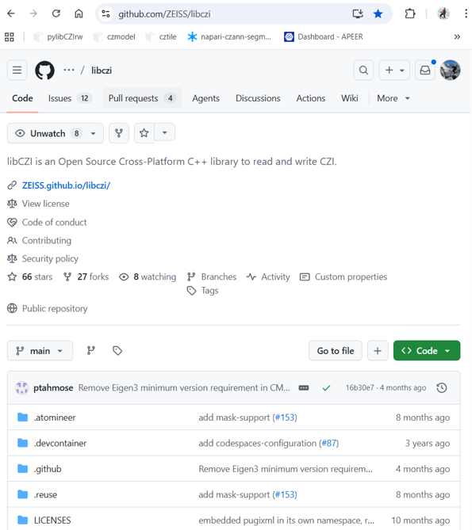
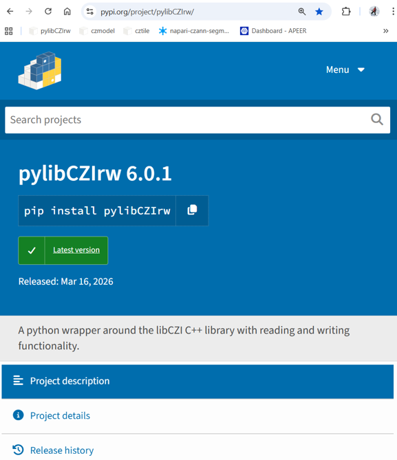
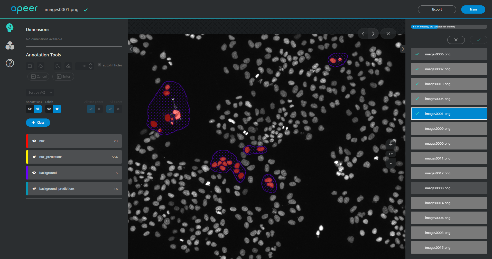
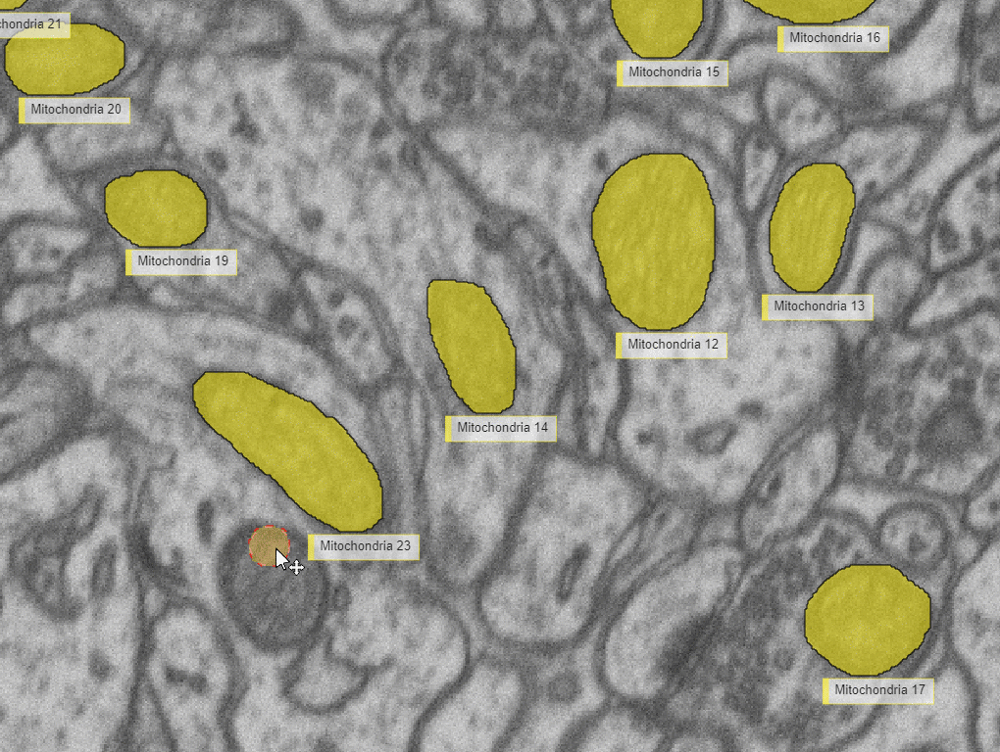
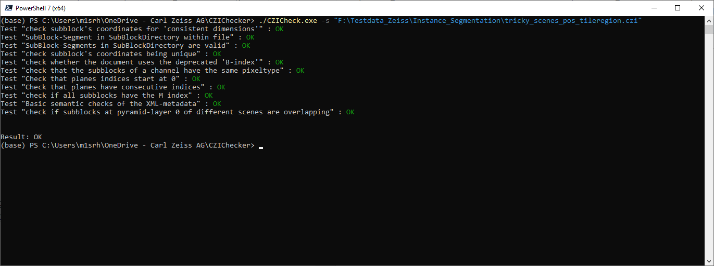

- [ZEN Python Workshop](#zen-python-workshop)
  - [Disclaimer](#disclaimer)
  - [General Remarks](#general-remarks)
  - [Prerequisites](#prerequisites)
    - [Install Pixi](#install-pixi)
    - [Install Python Environment](#install-python-environment)
    - [Additional Remarks](#additional-remarks)
  - [C++ library: libCZI](#c-library-libczi)
  - [pylibCZIrw (python wrapper for libCZI)](#pylibczirw-python-wrapper-for-libczi)
  - [czitools (experimental)](#czitools-experimental)
  - [napari-czitools (experimental)](#napari-czitools-experimental)
  - [CZI and OME-ZARR (experimental)](#czi-and-ome-zarr-experimental)
    - [Convert CZI to OME-ZARR using ome-zarr](#convert-czi-to-ome-zarr-using-ome-zarr)
    - [Convert CZI to OME-ZARR using ngff-zarr](#convert-czi-to-ome-zarr-using-ngff-zarr)
    - [Convert CZI to OME-ZARR HCS Plate using ome-zarr](#convert-czi-to-ome-zarr-hcs-plate-using-ome-zarr)
    - [Convert CZI to OME-ZARR HCS Plate using ngff-zarr](#convert-czi-to-ome-zarr-hcs-plate-using-ngff-zarr)
  - [Deep Learning Topics](#deep-learning-topics)
    - [Train a Deep-Learning Model for Semantic Segmentation on arivis Cloud](#train-a-deep-learning-model-for-semantic-segmentation-on-arivis-cloud)
    - [Use the CZANN model in your python code](#use-the-czann-model-in-your-python-code)
    - [Train your own model and package (as \*.czann) using the czmodel package](#train-your-own-model-and-package-as-czann-using-the-czmodel-package)
    - [Train a simple model for semantic segmentation](#train-a-simple-model-for-semantic-segmentation)
    - [Use the model inside Napari (experimental)](#use-the-model-inside-napari-experimental)
  - [CZICheck - Check CZI for internal errors](#czicheck---check-czi-for-internal-errors)
  - [Useful Links](#useful-links)


# ZEN Python Workshop

## Disclaimer

This content of this repository is free to use for everybody and purely experimental. The authors undertakes no warranty concerning the use of the code examples, ose scripts, image analysis settings and ZEN experiments, especially not for the examples using 3rd python modules. Use them on your own risk.

**By using any of those examples you agree to this disclaimer.**

## General Remarks

This repository contains scripts and notebooks showcasing several tools and scripts centered around ZEN, CZI image files, deep-learning models and related python packages.

## Prerequisites

### Install Pixi

- Download and install Miniconda if needed: [Download Pixi](https://pixi.prefix.dev/latest/installation/)
- Pixi Binaries can be found here: [Pixi Binary Release](https://github.com/prefix-dev/pixi/releases/tag/v0.68.1)
- check if installation was successful and check for updates:

```cmd
pixi --version
pixi self-update
```

### Install Python Environment

```cmd
pixi install
```

### Additional Remarks

> Important: If one wants to test the labeling & training directly on [arivis Cloud] or create a module it is required to have an account.
>
> To use [Colab] one needs to have a Google account.

## C++ library: libCZI

[libCZI] is an Open Source Cross-Platform C++ library to read and write CZI.



- Repo: [https://github.com/ZEISS/libczi](https://github.com/ZEISS/libczi)
- Docs: [https://zeiss.github.io/libczi/](https://zeiss.github.io/libczi/)
- License: LGPL v3

libCZI is a library intended for providing read and write access:

- reading subblock pixeldata 
- works with tiled and pyramidal images
- composing multi-channel images with tinting and applying a gradation curves
- access metadata
- writing subblocks and metadata
- used by [aicspylibczi] and [bioio-czi]

## pylibCZIrw (python wrapper for [libCZI])

A simple and easy-to-use Python wrapper for [libCZI](https://github.com/ZEISS/libczi) - a cross-platform C++ library intended for providing read and write access to CZI documents



- PyPi: [https://pypi.org/project/pylibCZIrw/](https://pypi.org/project/pylibCZIrw/)
- Repo: [https://github.com/ZEISS/pylibczirw](https://github.com/ZEISS/pylibczirw)
- Docs: [https://zeiss.github.io/pylibczirw/](https://zeiss.github.io/pylibczirw/)
- License: LGPL v3

Simple and easy-to-use Python wrapper for [libCZI] providing read and write access to CZI image documents

- reading any 2D plane and ROIs from any dimension
- On-the-fly interpolations
- access metadata
- writing 2D planes to any dimension
- Used by [bioio-czi](https://pypi.org/project/bioio-czi/) library

| Topic                     | Link                                                                                                                                                                                                     |
| ------------------------- | -------------------------------------------------------------------------------------------------------------------------------------------------------------------------------------------------------- |
| Use pylibCZIrw            | [](https://colab.research.google.com/github/sebi06/ZEN_Python_Workshop/blob/main/notebooks/using_pylibCZIrw.ipynb)             |
| Segment with Voronoi-Otsu | [](https://colab.research.google.com/github/sebi06/ZEN_Python_Workshop/blob/main/notebooks/read_czi_segment_voroni_otsu.ipynb) |

## czitools (experimental)

This repository provides a collection of tools to simplify reading CZI (Carl Zeiss Image) pixel and metadata in Python. It is available as a Python Package on PyPi.

> Disclaimer: [czitools] is an experimental python package and not officially supported by ZEISS. The authors undertakes no warranty concerning its use.

PyPi: [https://pypi.org/project/czitools/](https://pypi.org/project/czitools/)
Repo: [https://github.com/sebi06/czitools](https://github.com/sebi06/czitools)
Docs: [https://sebi06.github.io/czitools/latest/](https://sebi06.github.io/czitools/latest/)
License: GPL v3

- read complete stacks or substacks of CZI as numpy or dask arrays incl. lazy-loading
- read complete or partial metadata is a structured format
- get the plantable from a CZI
- create OME-ZARR from CZI

| Topic               | Link                                                                                                                                                                                           |
| ------------------- | ---------------------------------------------------------------------------------------------------------------------------------------------------------------------------------------------- |
| Read CZI Metadata   | [](https://colab.research.google.com/github/sebi06/ZEN_Python_Workshop/blob/main/notebooks/read_czi_metadata.ipynb)  |
| Read CZI Pixel Data | [](https://colab.research.google.com/github/sebi06/ZEN_Python_Workshop/blob/main/notebooks/read_czi_pixeldata.ipynb) |
| Get CZI PlaneTable  | [](https://colab.research.google.com/github/sebi06/ZEN_Python_Workshop/blob/main/notebooks/get_planetable.ipynb)     |
| OME-ZARR from CZI   | [](https://colab.research.google.com/github/sebi06/ZEN_Python_Workshop/blob/main/omezarr_from_czi_5d.ipynb)          |

## napari-czitools (experimental)

> Disclaimer: [napari-czitools] is an experimental Napari plugin and not officially supported by ZEISS. The authors undertakes no warranty concerning its use.

In order to use such a model one needs a running python environment with [Napari] and the [napari-czitools] plugin installed.

For more detailed information about the plugin please go to: [Napari Hub - napari-czitools](https://napari-hub.org/plugins/napari-czitools.html)

## CZI and OME-ZARR (experimental)

All OME-ZARR related scripts here are purely experimental. The authors undertakes no warranty concerning the use of those scripts.

**By using any of those examples you agree to this disclaimer.**

### Convert CZI to OME-ZARR using [ome-zarr]

See: [write_omezarr_adv.py](./workshop/czi_omezarr/write_omezarr_adv.py)

### Convert CZI to OME-ZARR using [ngff-zarr]

See: [write_omezarr_adv.py](./workshop/czi_omezarr/write_omezarr_ngff.py)

### Convert CZI to OME-ZARR HCS Plate using [ome-zarr]

See: [write_omezarr_adv.py](./workshop/czi_omezarr/write_hcs_omezarr.py)

### Convert CZI to OME-ZARR HCS Plate using [ngff-zarr]

See: [write_omezarr_adv.py](./workshop/czi_omezarr/write_hcs_ngffzarr.py)

## Deep Learning Topics

### Train a Deep-Learning Model for Semantic Segmentation on arivis Cloud

It is straight forward to train AI models for sematic and instance segmentation on [arivis Cloud]. The training is based on a zero-code approach and especially suited for beginners.

For the the examples below the focus in on **Semantic Segmentation** only.

- login to **[arivis Cloud]** (requires account)
- create **New Dataset**
- upload the test images inside: `..\notebooks\nucleus_data\images\`
- all images will be converted to CZIs automatically



- start labeling the data by pressing **Annotate**
- create labels manually or use the AI-assisted tool (SAM-based)
- label some nuclei "precisely"
- label background areas and edges
- embrace the idea of partial labeling



For more detailed information please visit: [Docs - Partial Annotations](https://docs.apeer.com/machine-learning/annotation-guidelines)

Once the training is finished one will get notified via mail and the model can be downloaded as an *.czann file, which is an ONNX model plus model metadata. For detail see: [czmodel]

Remark: The the modelfile: **cyto2022_nuc2.czann** can be found inside the repository and can be used directly for the examples.

### Use the CZANN model in your python code

Once the model (*.czann) is trained it can be downloaded directly to your hard disk and used to segment images in ZEN or arivis Pro or your own python code.

| Topic                             | Link                                                                                                                                                                                                  |
| --------------------------------- | ----------------------------------------------------------------------------------------------------------------------------------------------------------------------------------------------------- |
| Run CZANN Model from arivis Cloud | [](https://colab.research.google.com/github/sebi06/ZEN_Python_Workshop/blob/main/notebooks/run_prediction_from_czann.ipynb) |

### Train your own model and package (as *.czann) using the [czmodel] package

The [czmodel] package provides simple-to-use conversion tools to generate a CZANN file from a [PyTorch] or [ONNX] model that resides in memory or on disk to be usable in the ZEN, arivis Cloud, arivis Pro software platforms and **in your own code**.

For details and more information examples please go to: [czmodel]

### Train a simple model for semantic segmentation

| Topic                           | Link                                                                                                                                                                                                                |
| ------------------------------- | ------------------------------------------------------------------------------------------------------------------------------------------------------------------------------------------------------------------- |
| Train Model and export as CZANN | [](https://colab.research.google.com/github/sebi06/ZEN_Python_Workshop/blob/main/notebooks/SingleClassSemanticSegmentation_PyTorch.ipynb) |

### Use the model inside Napari (experimental)

> Disclaimer: [napari-czann-segment] is an experimental Napari plugin and not officially supported by ZEISS. The authors undertakes no warranty concerning its use.

For more detailed information about the plugin please go to: [Napari Hub - napari-czann-segment](https://www.napari-hub.org/plugins/napari-czann-segment)


## CZICheck - Check CZI for internal errors

[CZICheck] is a command-line application developed using libCZI, enabling users to assess the integrity and structural correctness of a CZI document.

Checking the validity of a CZI becomes more complex the closer one is to the application domain (e.g. application-specific metadata).
So this console application is more of a utility to help users who are directly using [libCZI], or its python wrapper [pylibCZIrw] & [pylibCZIrw_github], than it is an official validation tool for any ZEISS-produced CZIs.

CZICheck runs a collection of *checkers* which evaluate a well defined rule.
Each *checker* reports back findings of type Fatal, Warn, or Info.

Please check the tool's internal help by running `CZICheck.exe --help` and check additional documentation on the repository.



## Useful Links

---

| Name/Description                                      | Link                                                                                    | Name/Description                                      | Link                                                |
| ----------------------------------------------------- | --------------------------------------------------------------------------------------- | ----------------------------------------------------- | --------------------------------------------------- |
| Napari - Python-based image viewer                    | [GitHub](https://github.com/napari/napari)                                              | pip - Python Package Installer                        | [PyPI](https://pypi.org/project/pip/)               |
| PyPi - Python Package Index                           | [PyPI](https://pypi.org/)                                                               | pylibCZIrw - Python Package to read & write CZI files | [PyPI](https://pypi.org/project/pylibCZIrw)         |
| pylibCZIrw - GitHub Repository for CZI files (Python) | [GitHub](https://github.com/ZEISS/pylibczirw)                                           | czmodel - Package for Pytorch & ONNX models           | [PyPI](https://pypi.org/project/czmodel)            |
| cztile - Python Package for tiling arrays             | [PyPI](https://pypi.org/project/cztile)                                                 | arivis Cloud - DL Training Platform                   | [arivis Cloud](https://www.arivis.cloud)            |
| napari-czann-segment - Napari Plugin for DL models    | [GitHub](https://github.com/sebi06/napari_czann_segment)                                | napari-czitools - Plugin for CZI files                | [GitHub](https://github.com/sebi06/napari-czitools) |
| CZI - Carl Zeiss Image Format                         | [ZEISS](https://www.zeiss.com/microscopy/int/products/microscope-software/zen/czi.html) | PyTorch                                               | [PyTorch](https://pytorch.org)                      |
| ONNX                                                  | [ONNX](https://onnx.ai)                                                                 | libCZI - GitHub Repository for CZI files (C++)        | [GitHub](https://github.com/ZEISS/libczi)           |
| czitools - Tools for CZI files                        | [PyPI](https://pypi.org/project/czitools)                                               | Colab                                                 | [Colab](https://colab.research.google.com)          |
| Docker Desktop                                        | [Docker Desktop](https://www.docker.com/products/docker-desktop)                        | CZICompress - Shrink CZI files                        | [GitHub](https://github.com/ZEISS/czicompress)      |
| CZIChecker - Check Integrity of CZI files             | [GitHub](https://github.com/ZEISS/czicheck)                                             | ome-zarr - Python Implementation of NGFF Specs        | [GitHub](https://github.com/ome/ome-zarr-py)        |
| NGFF - Next-generation File Formats                   | [NGFF](https://ngff.openmicroscopy.org/)                                                | ngff-zarr - Python Implementation of NGFF Specs       | [GitHub](https://github.com/fideus-labs/ngff-zarr)  |

---

[Napari]: https://github.com/napari/napari
[pip]: https://pypi.org/project/pip/
[pylibCZIrw]: https://pypi.org/project/pylibCZIrw
[pylibCZIrw_github]: https://github.com/ZEISS/pylibczirw
[czmodel]: https://pypi.org/project/czmodel
[arivis Cloud]: https://www.arivis.cloud
[napari-czann-segment]: https://github.com/sebi06/napari_czann_segment
[napari-czitools]: https://github.com/sebi06/napari-czitools
[PyTorch]: https://pytorch.org
[ONNX]: https://onnx.ai
[libCZI]: https://github.com/ZEISS/libczi
[czitools]: https://pypi.org/project/czitools
[Colab]: https://colab.research.google.com
[Docker Desktop]: https://www.docker.com/products/docker-desktop
[CZICompress]: https://github.com/ZEISS/czicompress
[ome-zarr]: https://github.com/ome/ome-zarr-py
[ngff-zarr]: https://github.com/fideus-labs/ngff-zarr
[bioio-czi]: https://pypi.org/project/bioio-czi/
[aicspylibczi]: https://pypi.org/project/aicspylibczi/
[napari-czitools]: https://pypi.org/project/napari-czitools/