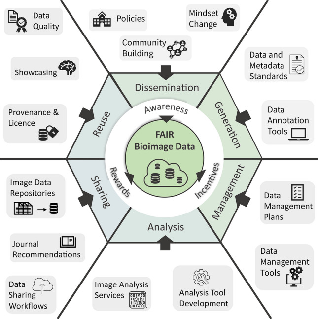
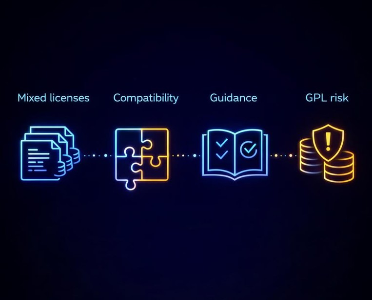
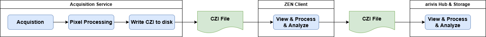
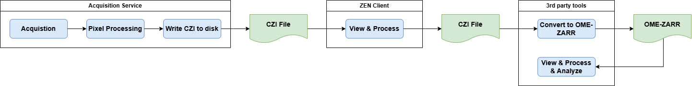
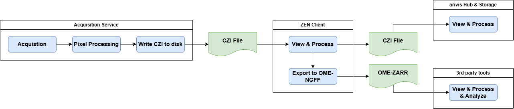
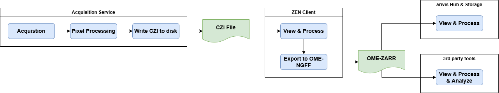
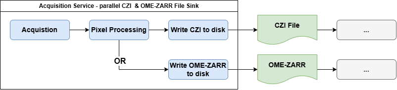

## Vendor Perspective on Operationalizing OME-NGFF


- From Promise to Product: Why This Discussion Matters
- Context and Motivation: Momentum Meets Product Reality
- The ZEISS Perspective: Experience Across the Full Product Stack
- Where OME-NGFF Works Well Today
- Key Barrier 1: Technical Constraints in Acquisition Workflows
- Key Barrier 2: Licensing and Legal Clarity
- Key Barrier 3: Business and Operational Viability
- Use Case 1: Real-Time Acquisition Systems
- Use Case 2: Cloud Analytics and AI Pipelines
- Use Case 3: Hybrid Pipelines Combining CZI and NGFF
- Use Case 4: Product Lifecycle and Long-Term Support
- What ZEISS Brings to the Community
- Opportunities for Collaboration
- Closing: Bridging Promise and Product Together

## From Promise to Product: Why This Discussion Matters


```{mermaid}
%%{init: {'theme': 'base', 'themeVariables': { 'primaryColor': '#1e3a5f', 'primaryTextColor': '#fff', 'primaryBorderColor': '#0d47a1', 'lineColor': '#1565c0', 'secondaryColor': '#e3f2fd', 'tertiaryColor': '#bbdefb', 'background': '#ffffff'}}}%%

flowchart LR
    subgraph PROMISE["<b>PROMISE</b>"]
        direction TB
        A["💡<br/>Conceptual<br/>Proposals"]
        B["📄<br/>OME-NGFF<br/>Specification"]
        A --> B
    end

    subgraph PROGRESS["<b>PROGRESS</b>"]
        direction TB
        C["🔬<br/>Research<br/>Adoption"]
        D["☁️<br/>Integrations<br/>Tooling<br/>Ecosystem"]
        C --> D
    end

    subgraph PRODUCT["<b>PRODUCT</b>"]
        direction TB
        E["🏭<br/>Vendor<br/>Implementation"]
        F["👥<br/>Customer<br/>Workflows"]
        E --> F
    end

    PROMISE ==> PROGRESS ==> PRODUCT

    PRODUCT --> G["⚖️ <b>BALANCE</b><br/>Openness ↔ Robustness"]
    PRODUCT --> H["🎯 <b>IMPACT</b><br/>Performance • Integrity • Experience"]
    PRODUCT --> I["⚠️ <b>CHALLENGES</b><br/>Validation • Licensing • Real-Time Ops"]

    style PROMISE fill:#e8f5e9,stroke:#2e7d32,stroke-width:2px
    style PROGRESS fill:#e3f2fd,stroke:#1565c0,stroke-width:2px
    style PRODUCT fill:#fff3e0,stroke:#ef6c00,stroke-width:2px
```

- **Transition from concept to adoption:** OME-NGFF has evolved from concepts to an adopted technology in research and cloud computing.

- **Importance for vendors:** File formats shape workflows, performance, data integrity, and customer experience in products.

- **Balancing openness and robustness:** Vendors must support interoperability while meeting strict requirements for robustness and lifecycle management.

- **Sustainable adoption challenges:** Validation costs, licensing due diligence, and real-time operation under acquisition load remain material constraints.


::: {.notes}
The discussion around OME-NGFF has reached an important inflection point. Over the past several years, OME-NGFF and its concrete implementation in OME-Zarr have transitioned from conceptual proposals to widely adopted technologies in research, cloud computing, and large-scale bioimaging analytics.

For vendors such as ZEISS, this shift is highly relevant because file formats are no longer passive containers for data; they are integral components of end-to-end product workflows, influencing acquisition performance, data integrity, customer experience, and long-term support obligations.

The title "From Promise to Product" reflects the reality that a technically compelling specification does not automatically translate into a production-ready component suitable for commercial microscopes and software platforms. Vendors must balance openness and interoperability with strict requirements around robustness, predictable performance, and lifecycle management.

This presentation is motivated by increasing customer interest in NGFF-based workflows, particularly for cloud analytics, FAIR data sharing, and AI-driven applications. At the same time, development and product teams encounter concrete constraints that are rarely visible in academic or community-driven discussions, such as validation costs, licensing due diligence, and sustained operation under real-time acquisition loads. Addressing these topics openly is not an attempt to slow adoption, but rather to ensure that adoption is sustainable and aligned with real-world use.

By framing this talk as a vendor perspective, ZEISS aims to contribute practical insight that complements the strong technical foundation laid by the OME community. The goal is to identify where OME-NGFF already delivers clear value, where gaps remain, and how collaboration can help bridge those gaps so that NGFF technologies can move confidently from promising prototypes into reliable components of commercial products.
:::

### Context and Motivation: Momentum Meets Product Reality

::: {.columns}
::: {.column width="60%"}
- **Rapid adoption and benefits:** OME-NGFF and OME-Zarr continue gaining momentum through scalable datasets, cloud compatibility, and alignment with FAIR principles.
- **Product development challenges:** Commercial microscopy requires strict performance, reliability, and usability guarantees beyond the format specification itself.
- **Balancing enthusiasm and caution:** Vendors can support openness while still asking for clarity on performance, licensing, and sustainability.
- What will be the real **ROI** for vendors to adopt NGFF in acquisition pipelines, and how can the community help clarify this?
:::

::: {.column width="40%"}
{fig-alt="FAIR principles" fig-align="right" width="80%"}

::: {style="font-size: 0.6em; text-align: center; color: gray;"}
Source: [Kemmer et al. 2023](https://pmc.ncbi.nlm.nih.gov/articles/PMC10492678/)
:::
:::
:::


::: {.notes}
OME-NGFF and OME-Zarr are experiencing rapid momentum across academia, large-scale imaging facilities, and enterprise research environments. This momentum is driven by clear benefits such as scalable access to massive datasets, native compatibility with cloud object storage, and strong alignment with FAIR data principles.

From a vendor point of view, this growing adoption directly influences customer expectations. Increasingly, users expect their microscopy data to integrate seamlessly with downstream analytics platforms, collaborative environments, and AI toolchains. However, the realities of product development introduce additional considerations that extend beyond format specifications.

Commercial microscopy systems operate under strict performance, reliability, and usability requirements that are often invisible in pure research contexts. Acquisition software must operate deterministically, hardware integration must be tightly controlled, and failure modes must be explicitly handled to avoid data loss. Furthermore, product teams must consider how any new format affects documentation, customer support, testing pipelines, and long-term maintenance. Motivation for this discussion stems from the growing gap between perceived readiness and actual product integration effort.

While NGFF technologies are extremely well-suited for certain classes of problems, particularly post-acquisition workflows, they are sometimes assumed to be universally applicable without sufficient consideration of operational constraints. This presentation therefore seeks to articulate why enthusiasm and caution are not contradictory positions.

Vendors can strongly support the goals of openness and interoperability while simultaneously asking for clarity on performance boundaries, licensing implications, and business sustainability. Recognizing these factors early helps prevent fragmented adoption and sets the stage for broader, more robust use of NGFF across the full microscopy lifecycle.
:::

### The ZEISS Perspective: Experience Across the Full Product Stack


- **Comprehensive product experience:** ZEISS brings decades of expertise across hardware, software, and customer support.
- **Standards and interoperability:** Work with CZI, SIS, and OME-TIFF & Bio-Formats, informs practical decisions on interoperability and archival reliability.
- **Systemic design approach:** Formats influence acquisition, performance, metadata, UI, workflows, and service organizations.
- **Long-term and diverse use cases:** Products must remain stable across diverse environments and long product lifecycles.

::: {.notes}
ZEISS Microscopy brings a perspective shaped by decades of experience across hardware, acquisition software, data management, and long-term customer support. This includes extensive involvement with established standards such as OME-TIFF, deep integration of Bio-Formats for interoperability, and the continuous evolution of the proprietary CZI format to meet demanding acquisition and archival requirements. From this vantage point, file formats are not abstract technical choices but foundational design decisions that influence nearly every layer of a product.

Acquisition pipelines must sustain high-throughput data streams without compromising responsiveness or stability. Metadata models must remain consistent and extensible across product generations. Customers rely on backward compatibility to ensure that data generated today remains accessible many years into the future. Additionally, ZEISS products operate across diverse environments, from individual laboratories to large shared facilities and regulated industrial settings. This diversity amplifies the importance of predictable behavior, thorough validation, and clear documentation.

The ZEISS perspective is therefore inherently systemic. It considers not only how data is stored and accessed, but how formats interact with hardware control, user interfaces, automated workflows, and service organizations. When evaluating NGFF adoption, this holistic view highlights both strengths and challenges. OME-NGFF offers powerful capabilities for scalable access and interoperability, but it must be assessed in the broader context of commercial product responsibilities.

Sharing this perspective is intended to enrich the community conversation by adding practical constraints and long-term considerations that complement academic and research-driven innovation.
:::

### Where OME-NGFF Works Well Today

- **Efficient data handling:** Chunked storage enables selective access to large multidimensional datasets.
- **Cloud-native collaboration:** OME-Zarr fits remote visualization, collaborative analysis, and scalable compute workflows.
- **Integration with the data science ecosystem:** The format aligns well with Python tooling, machine learning frameworks, and web- and cloud-based workflows.
- **Support for FAIR principles:** OME-NGFF helps make data findable, accessible, interoperable, and reusable across institutions (FAIR).

::: {.notes}
From a vendor standpoint, it is essential to clearly acknowledge the areas where OME-NGFF already delivers strong and tangible value. These successes are real, measurable, and increasingly visible in customer workflows. OME-NGFF excels in post-acquisition contexts where large datasets must be explored, processed, or shared efficiently.

Chunked storage enables selective access to regions of interest without loading entire datasets, which is especially beneficial for large 3D, time-lapse, or high-content screening data. Cloud-native design makes OME-Zarr particularly attractive for remote visualization, collaborative analysis, and integration with scalable compute resources.

The format also aligns well with modern data science ecosystems, where Python-based tools, machine learning frameworks, and interactive notebooks are commonly used. In addition, OME-NGFF strongly supports FAIR principles, enabling data to be findable, accessible, interoperable, and reusable across institutional boundaries. These characteristics create clear customer value and justify continued investment. From ZEISS’s perspective, these strengths position OME-NGFF as a highly effective format for distribution, analysis, and secondary processing of imaging data.

Recognizing and reinforcing these successful use cases is critical, as it establishes a foundation of trust and shared understanding between vendors and the OME community. Rather than questioning the overall direction, this discussion builds on demonstrated strengths to explore how NGFF technologies can be extended responsibly into additional product domains.
:::

## ZEISS and ZEN & arivis have a lot of history


::: {.columns}
::: {.column width="60%"}

- **CZI format:** meet acquisition, processing and archival needs, with a focus on performance, metadata fidelity, and long-term stability.
- **SIS format:** meet processing and archival needs, with a focus on performance, metadata fidelity, and long-term stability.
- **Neither** of those two formats were developed based on the demands of todays AI workflows, data sizes and cloud-based workflows etc.
- **everything** in ZEN (acquisition, visualization, analysis, export, metadata management, ...) is built on top of "Image Documents" (similar situation for arivis)
:::

::: {.column width="40%"}
{fig-alt="ZEN interfaces" fig-align="right" width="100%"}

::: {style="font-size: 0.6em; text-align: center; color: gray;"}
Source: [ZEISS - OAD](https://github.com/zeiss-microscopy/OAD/blob/master/Images/ZEN_Interfaces.png)
:::
:::
:::

## Barriers and Open Questions for Broader NGFF Adoption in Commercial Products

### Key Barrier 1: Technical Constraints in Acquisition Workflows

- **Real-time data acquisition challenges:** Acquisition workflows require fast (up-to several GB/s), reliable writes with low latency under continuous load on Windows machines.
- **Limitations of chunked layouts:** Chunked, cloud-optimized layouts are excellent for reads but still challenging in write-heavy real-time environments.
- **Need for robust error handling:** Transactional integrity, partial write recovery, and predictable acquisition completion remain essential.
- **Collaborative solutions needed:** Design patterns, guidance, and benchmarks would increase confidence in broader adoption.

::: {.notes}
The first major barrier to broader NGFF adoption in commercial products lies in technical constraints associated with real-time acquisition workflows. Unlike post-acquisition analysis, data acquisition places strict demands on write performance, latency, and error handling. Microscopes often generate continuous streams of data that must be written reliably and quickly, with predictable behavior under sustained load.

Any delay, jitter, or failure can directly impact image quality or cause data loss. Chunked and cloud-optimized layouts, while highly advantageous for read performance and scalability, are not inherently optimized for these write-heavy scenarios. Additional complexity arises from requirements for transactional integrity, partial write recovery, and deterministic completion of acquisition steps. From a product perspective, edge cases must be handled gracefully, and system behavior must remain transparent to users.

These challenges do not imply that NGFF cannot support acquisition workflows, but they do indicate that additional design patterns, benchmarks, and implementation guidance are necessary. Vendors need clear answers to questions such as acceptable chunk sizing strategies, buffering approaches, and failure recovery mechanisms under real-time conditions. Addressing these topics collaboratively would significantly increase confidence in NGFF for broader adoption beyond its current strengths.
:::

### Key Barrier 2: Licensing and Legal Clarity

::: {.columns}
::: {.column width="60%"}

- **Mixed licensing ecosystem:** The OME ecosystem spans GPL, BSD, Apache, and commercial licenses. Vendors need "Freedom to Operate" across the entire stack, not just individual components.
- **Compliance complexity:** Vendors must ensure compatibility across proprietary and open-source components.
- **Need for clear guidance:** Practical guidance on compliant commercial integration would reduce uncertainty and review overhead.
- Using community components with very restrictive licenses (e.g., GPL) creates significant legal, operational, commercial and intellectual property risks for vendors
:::
::: {.column width="40%"}
{fig-alt="License Risks" fig-align="right" width="100%"}
:::
:::


::: {.notes}
Licensing and legal clarity represent a second critical barrier to NGFF adoption in commercial environments. The OME ecosystem intentionally employs a mix of licenses, including GPL, BSD, Apache, and commercial licensing options, to balance openness with sustainability. While this approach is well understood within the community, it introduces complexity for vendors who must ensure full compliance across entire software stacks.

Commercial products typically integrate multiple components, some proprietary and others open source, which makes license compatibility and distribution obligations a significant concern. Ambiguity around which components can be safely embedded, linked, or redistributed creates risk and slows down decision-making. Legal review processes are time-consuming and can become bottlenecks in product development.

From a vendor perspective, clearer, more explicit guidance on recommended commercial integration paths would greatly reduce uncertainty. This does not require changing existing licenses, but rather providing practical documentation and examples that illustrate compliant usage patterns. By reducing ambiguity, the community can make it easier for vendors to engage confidently, invest engineering resources, and commit to long-term support of NGFF-based solutions.
:::

### Key Barrier 3: Business and Operational Viability

- **Ongoing operational costs:** New formats add continuing cost in validation, documentation, training, support, and maintenance.
- **Complexity of multi-format support:** Transition periods often require supporting multiple formats at once.
- **Return on investment challenges:** Technical advantages for certain scenarios might be real, but are investments in OME-NGFF more promising than other priorities?
- **Aligning innovation with sustainability:** Transparent cost-benefit discussions help scale adoption into mainstream products. Why will vendors invest in NGFF support when customer demand is still emerging, and R&D budgets are constrained?

::: {.notes}
Beyond technical and legal considerations, business and operational viability play a decisive role in vendor adoption decisions. Integrating a new file format is not a one-time development task; it triggers ongoing costs across validation, documentation, training, customer support, and maintenance. Many vendors must support dual-format pipelines during transition periods, increasing complexity and testing overhead.

Each supported format multiplies the number of scenarios that must be validated and maintained. Furthermore, the return on investment for NGFF adoption is not always immediately clear, especially when customer demand is emerging but not yet universal. Product teams must prioritize features that deliver measurable value under constrained R&D budgets.

Without clear customer-driven use cases or market signals, even technically attractive solutions may struggle to secure long-term investment. By explicitly acknowledging these business realities, the community can help shape NGFF evolution in ways that align technical innovation with operational sustainability. Transparent discussion of costs, benefits, and transition strategies is essential to ensure that NGFF adoption can scale beyond niche applications into mainstream commercial products.
:::

## Use Case Scenarios: Where NGFF Fits and Where Gaps Remain

The following slides are there to **illustrate** a bit the problem & solutions spaces from a vendor perspective.

- They are not meant to be exhaustive and also **do not represent** any decisions yet.
- They are meant to be a **starting point for discussion and collaboration**, and to help identify where the community can best focus efforts to support sustainable NGFF adoption in commercial products.

### Scenario 1: How things in ZEN work today


{fig-alt="ZEN Workflow" fig-align="center" width="100%"}


- **raw data** arrives from the detector, is processed and stored in CZI format on disk
- ZEN reads the CZI data and created an **Image Document**, which is the central data structure for all operations in ZEN (visualization, analysis, processing, metadata management, ...)
- further **processing & visualization** in arivis Pro (desktop) or arivis Hub (server/cloud) use CZI image files as well


### Scenario 2: Use external conversion tools


{fig-alt="External Converters" fig-align="center" width="100%"}

- ZEISS offers **open ZISRAW specification & public APIs and tools** (C++, Python, .NET) to read & write CZI data directly from disk, without the need for conversion
- those tools enable "3rd party tools" to convert CZI  &rarr; OME_ZARR with reasonable effort, and to build custom pipelines on top of that

**Devil's advocate questions from Management & Product Teams** :wink: :

- Why even worry, if the community is using their own tools for analysis anyway and develops their own image analysis and processing tools anyway?


### Scenario 2: Use external conversion tools (continued)

<div style="text-align:center;">
  <video style="width:100%; height:auto;" controls autoplay loop muted playsinline preload="auto">
    <source src="videos/czi2omezarr.mp4" type="video/mp4">
  </video>
</div>


### Scenario 3: Integrate OME_ZARR export into our software


{fig-alt="Internal Converter" fig-align="center" width="100%"}

- integrate existing or self-maintained converter into ZEN & arivis to enable export CZI &rarr; OME-ZARR directly without needing to use external tools
- experience with licensing BioFormats (in ZEN) to read 3rd file formats and export to OME-TIFF are mixed ...

**Devil's advocate questions from Management & Product Teams** :wink: :

- Why should a vendor obtain a commercial license for a converter or invest resources to create their own converter if the community already has those anyway?

### Scenario 4: Integrate OME_ZARR export and use it for specific scenarios


{fig-alt="OME-ZARR - 1st class citizen" fig-align="center" width="100%"}

- since we need scalable image processing and server & cloud deployment using OME-ZARR directly might be a good idea
- requires that the complete processing and image analysis stack can read and write OME-ZARR, but currently ZEN & arivis are built on .NET


**Devil's advocate questions from Management & Product Teams** :wink: :

- Sounds nice, but why not optimizing our own formats first - refactoring our the complete SW ecosystem will probably never pay off?
- Industry customers (with money) do not care about the "format used", but about the "features delivered" - so why not just focus on delivering features and let the community worry about the format?


### Exploring Options - PixelStream &rarr; OME-ZARR

<div style="text-align:center;">
  <video style="width:100%; height:auto;" controls loop muted playsinline preload="auto">
    <source src="videos/napari_omezarr_stream1.mp4" type="video/mp4">
  </video>
</div>

- ZEN-API PixelStream &rarr; OME-ZARR - acquisition started via ZEN API from Napari
- Remark: Purely experimental to "showcase" the topic


### Exploring Options - PixelStream &rarr; OME-ZARR (continued)

<div style="text-align:center;">
  <video style="width:100%; height:auto;" controls loop muted playsinline preload="auto">
    <source src="videos/napari_omezarr_stream2.mp4" type="video/mp4">
  </video>
</div>

- ZEN-API PixelStream &rarr; OME-ZARR - acquisition started from ZEN UI
- Remark: Purely experimental to "showcase" the topic


### Scenario 4: Write OME-ZARR directly in specific scenarios (continued)


{fig-alt="OME-ZARR - Write directly" fig-align="center" width="80%"}

- integrate an OME-ZARR file sink into our processing graph &rarr; stream to OME-ZARR directly in specific scenarios
- how should the user view those data directly in ZEN since our current viewer do not speak OME-ZARR?

**Devil's advocate questions from Management & Product Teams** :wink: :

- Why should we do this directly and not afterwards with a converter, if the community already has those anyway?
- The effort to our SW to "view" OME-ZARRs as they are written directly is huge. What is the ROI - "viewing during acquisition" is a MUST-HAVE feature

## Further Remarks, Considerations & Use Cases

### Use Case 1: Real-Time Acquisition Systems

- **Demanding environment:** High-throughput acquisition is tightly coupled with hardware control and synchronization.
- **Importance of deterministic latency:** Timing disruptions can compromise acquisition and experimental outcomes.
- **Challenges with OME-NGFF:** Sustained write throughput and deterministic acquisition completion remain open concerns.
- **Community effort opportunities:** Profiles, buffering strategies, and benchmarks would help clarify feasibility.

::: {.notes}
Real-time acquisition systems represent one of the most demanding environments for any data format. In these systems, high-throughput data generation is tightly coupled with hardware control, synchronization, and user interaction. Deterministic latency is essential, as delays can disrupt acquisition timing or compromise experimental results. Error handling must be robust, with clear recovery paths that protect both data integrity and user confidence.

Within this context, OME-NGFF currently presents challenges as a primary acquisition format. While its architecture offers many advantages for scalable access, the requirements of sustained write throughput and predictable completion of acquisition steps are not yet comprehensively addressed in reference implementations or guidelines. Vendors therefore tend to rely on established acquisition formats optimized specifically for these conditions.

This use case highlights where additional community effort could make a meaningful difference, for example by defining acquisition-oriented profiles, recommending buffering and sharding strategies, or sharing performance benchmarks. Addressing these needs would help determine whether and how NGFF could play a more direct role in future acquisition workflows.
:::

### Use Case 2: Cloud Analytics and AI Pipelines

- **Efficient data access:** Chunked storage enables retrieval of just the required data subset.
- **Optimized for machine learning:** Non-sequential access and parallel reads align well with ML training workflows.
- **Seamless cloud integration:** Supporting NGFF reduces friction between local systems and cloud analytics platforms.

**Devil's advocate questions from Management & Product Teams** :wink: :

- Our AI pipelines incl storing labels are built on-top of CZI, SIS and our object storage.
- Why should we rework all of this if the community does use their own AI tools often?


::: {.notes}
Cloud analytics and AI pipelines are an area where OME-NGFF already demonstrates clear alignment with vendor and customer needs. In these workflows, data is typically processed after acquisition, often at scale, and with an emphasis on flexible access patterns rather than deterministic writes. OME-Zarr’s chunked storage enables efficient interaction with subsets of large datasets, reducing data transfer and improving responsiveness in interactive applications.

This design works particularly well for machine learning, where training algorithms often access data non-sequentially and benefit from parallel reads. From a vendor perspective, supporting NGFF in this domain enhances customer value by enabling seamless integration with modern analytics ecosystems.

It also reduces friction when customers move data between local systems and cloud environments. As a result, this use case provides a strong justification for continued investment in NGFF support and serves as a reference point for success. Understanding why NGFF performs well here can inform efforts to extend similar benefits into other parts of the workflow.
:::


### Use Case 3: Product Lifecycle and Long-Term Support

- **Extended product lifecycles:** Microscopy products often need support for ten years or more.
- **Backward compatibility importance:** Predictable evolution and migration protect customer investments.
- **Governance and stability:** Clear versioning, reference implementations, and transparent governance build confidence.

::: {.notes}
Commercial microscopy products often have lifecycles extending ten years or more, which introduces requirements that differ markedly from those of research prototypes. Backward compatibility is essential to protect customer investments and ensure continued access to historical data. Format specifications must evolve predictably, with clear deprecation and migration strategies.

Frequent or disruptive changes increase validation effort and raise support costs. From a vendor perspective, long-term stability is a prerequisite for deep integration into core product functionality. NGFF adoption in this context depends not only on technical capability, but also on governance practices that support controlled evolution.

Transparent roadmaps, clear versioning policies, and strong reference implementations can help build the confidence required for long-term commitments. This use case underscores the importance of aligning technical innovation with product lifecycle realities.
:::

## What ZEISS could bring to the Community

- **Real-world insights:** ZEISS can contribute direct knowledge of acquisition constraints and product performance.
- **Customer deployment feedback:** Production deployments expose edge cases and help validate assumptions.
- **Collaborative innovation:** ZEISS can help with hybrid architectures, benchmark criteria, and commercially realistic usage patterns.
- **Supporting standards evolution:** Practical constraints can strengthen, not weaken, the standardization process.

::: {.notes}
ZEISS approaches the NGFF discussion not only with requirements, but also with concrete contributions to offer. These include detailed insight into real-world acquisition constraints, performance expectations derived from production systems, and experience managing complex product lifecycles. 

ZEISS can provide feedback grounded in actual customer deployments, helping to validate assumptions and identify edge cases early. In addition, the company is willing to collaborate on defining hybrid reference architectures, sharing benchmark criteria, and refining usage patterns that reflect commercial realities.

By contributing this perspective, ZEISS aims to support the maturation of NGFF technologies in ways that benefit both vendors and end users. Collaboration built on transparency and mutual respect helps ensure that standards evolve in step with practical needs.
:::

### Opportunities for Collaboration

- **Clear usage profiles:** Separate acquisition, distribution, and analytics profiles would improve expectations and implementation guidance.
- **Improved documentation:** Better licensing and commercial integration guidance would reduce adoption friction.
- **Joint benchmarks development:** Shared benchmarks and reference workflows would make readiness easier to assess.
- **Customer-driven use cases:** Real-world demand should continue guiding technical evolution.

::: {.notes}
The challenges identified in this presentation also represent opportunities for deeper collaboration between vendors and the OME community. Defining clearer usage profiles for acquisition, distribution, and analytics can help set realistic expectations and guide implementation efforts.

Improved documentation around licensing and commercial integration can reduce friction and encourage broader participation. Joint development of benchmarks and reference workflows would provide concrete evidence of readiness and limitations. Most importantly, focusing on customer-driven use cases ensures that technical evolution remains aligned with real-world demand.

Collaboration framed around shared goals rather than opposing positions creates a productive path forward for NGFF adoption.
:::

## Closing: Bridging Promise and Product Together - but challenges remain

- **Foundations of OME-NGFF:** The format has strong technical foundations and an active community.
- **Vendor collaboration:** Vendors share the goal of open, interoperable, and scalable data ecosystems.
- **Sustainable adoption challenges:** Operational realism, legal clarity, and viable business models still matter.
- **Shared community effort:** Moving from promise to product is a collective responsibility.
- **Open business questions:** - Very challenging to **justify** the huge investment on vendor side - the resources could be also spend on other topics 

::: {.notes}
OME-NGFF has established itself as a powerful and forward-looking approach to bioimaging data management. Its technical foundations, community engagement, and demonstrated successes provide a strong basis for continued growth. Vendors such as ZEISS share the vision of open, interoperable, and scalable data ecosystems.

At the same time, sustainable adoption within commercial products requires attention to operational realism, legal clarity, and business viability. By addressing these factors collaboratively, the community can ensure that NGFF technologies move confidently from promising solutions to dependable product components.

Bridging the gap between promise and product is not the responsibility of any single group, but a shared effort that benefits the entire bioimaging ecosystem.
:::
